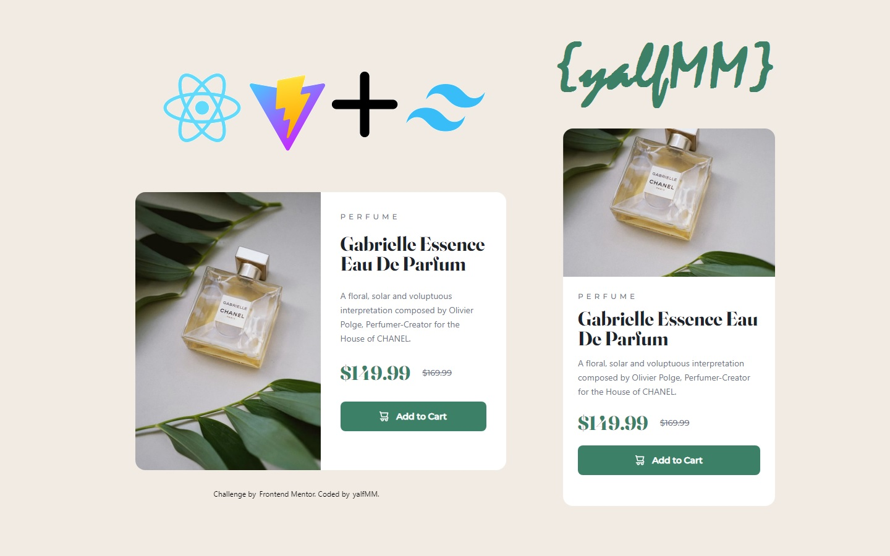

# Frontend Mentor - Product preview card component

## Hello! :wave:

Here is a solution to [Product preview card component](https://www.frontendmentor.io/challenges/product-preview-card-component-GO7UmttRfa). Frontend Mentor challenges help you improve your coding skills by building realistic projects. 

## Table of Content
- [Frontend Mentor - Product preview card component](#frontend-mentor---product-preview-card-component)
  - [Hello! :wave:](#hello-wave)
  - [Table of Content](#table-of-content)
    - [The challenge](#the-challenge)
    - [Screenshot](#screenshot)
  - [My Process](#my-process)
    - [What I learned](#what-i-learned)
    - [Built with](#built-with)
  - [Author](#author)
  - [Tailwind](#tailwind)
  - [React + Vite](#react--vite)

### The challenge

Users should be able to:

- View the optimal layout depending on their device's screen size
- See hover and focus states for interactive elements

### Screenshot

## My Process

### What I learned

- Build website in REACT with Vite build tool, creating styles with tailwind css.

### Built with

- REACT
- Tailwind CSS styles
- Vite compile tool
- Responsive Design

## Author

- Website - [github/yalfmm](https://github.com/yalfmm)
- Frontend Mentor - [@yalfmm](https://www.frontendmentor.io/profile/yalfmm)

## Tailwind

- [Install Tailwind CSS with Vite](https://tailwindcss.com/docs/guides/vite)

## React + Vite

This template provides a minimal setup to get React working in Vite with HMR and some ESLint rules.

Currently, two official plugins are available:

- [@vitejs/plugin-react](https://github.com/vitejs/vite-plugin-react/blob/main/packages/plugin-react/README.md) uses [Babel](https://babeljs.io/) for Fast Refresh
- [@vitejs/plugin-react-swc](https://github.com/vitejs/vite-plugin-react-swc) uses [SWC](https://swc.rs/) for Fast Refresh